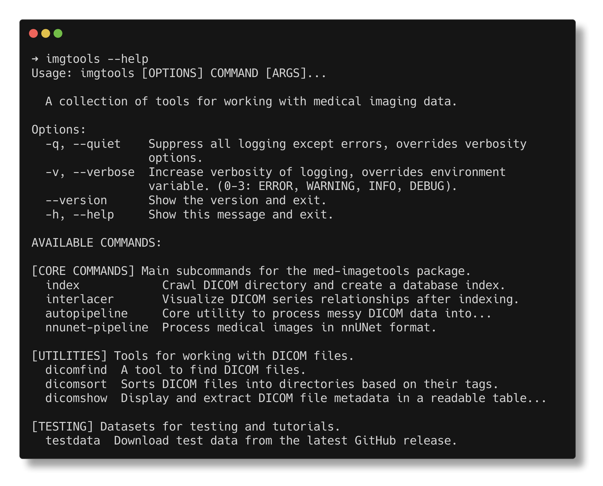

<div align="center">

# Med-Imagetools: Transparent and Reproducible Medical Image Processing Pipelines in Python


[](https://github.com/bhklab/med-imagetools/actions/workflows/main.yml)


[](https://med-imagetools.readthedocs.io/en/documentation/?badge=documentation)


[](https://pypi.org/project/med-imagetools/)
[](https://github.com/bhklab/med-imagetools/releases)
[](https://pypi.org/project/med-imagetools/)
[](https://hub.docker.com/r/bhklab/med-imagetools)
[](https://hub.docker.com/r/bhklab/med-imagetools/tags)

[](https://pypi.org/project/med-imagetools/)
[](https://pepy.tech/project/med-imagetools)
[](https://codecov.io/gh/bhklab/med-imagetools)


**Installation and Usage Documentation**: [https://bhklab.github.io/med-imagetools](https://bhklab.github.io/med-imagetools)

</div>
<!--intro-start-->

## Med-ImageTools core features

Med-Imagetools, a python package offers the perfect tool to transform messy
medical dataset folders to deep learning ready format in few lines of code.
It not only processes DICOMs consisting of different modalities
(like CT, PET, RTDOSE and RTSTRUCTS), it also transforms them into
deep learning ready subject based format taking the dependencies of
these modalities into consideration.  



## Introduction

A medical dataset, typically contains multiple different types of scans
for a single patient in a single study. As seen in the figure below,
the different scans containing DICOM of different modalities are
interdependent on each other. For making effective machine
learning models, one ought to take different modalities into account.


Fig.1 - Different network topology for different studies of different patients

Med-Imagetools is a unique tool, which focuses on subject
based Machine learning. It crawls the dataset and makes
a network by connecting different modalities present
in the dataset. Based on the user defined modalities,
med-imagetools, queries the graph and process the
queried raw DICOMS. The processed DICOMS are saved as nrrds,
which med-imagetools converts to torchio subject dataset and
eventually torch dataloader for ML pipeline.

## Installing med-imagetools

```console
pip install med-imagetools
imgtools --help
```

```console
uvx --from 'med-imagetools[all]' imgtools --help
```

## Repository Stars

[](https://star-history.com/#bhklab/med-imagetools)

## License

This project uses the following license: [MIT License](https://github.com/bhklab/med-imagetools/blob/master/LICENSE)
<!--intro-end-->
