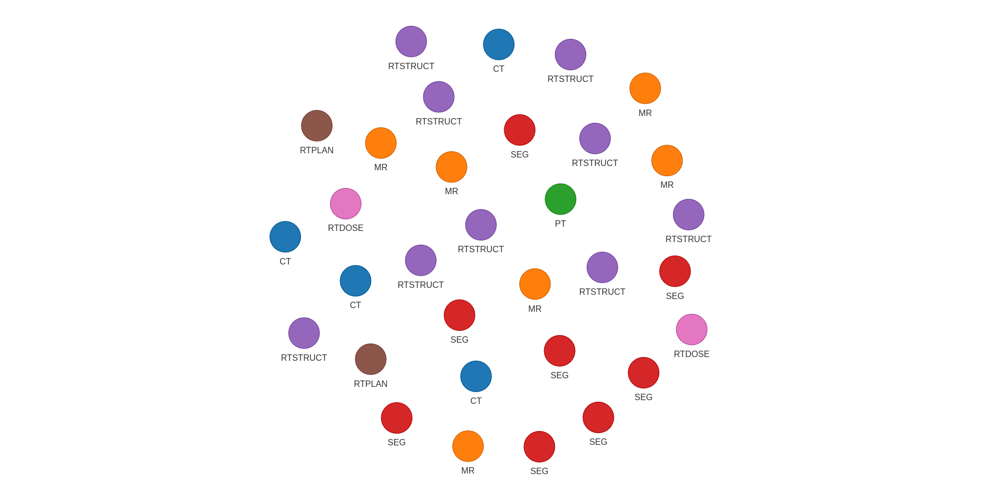

# Interlacer Module

The **Interlacer** module builds and searches a tree-like structure made from DICOM series using metadata links. This makes it easier to group, explore, and work with medical imaging data. 


!!! note 

    This module is available in `med-imagetools 2.0` and later versions.
    It replaces the now deprecated `DataGraph` module from `med-imagetools 1.0`.

---

## Overview

This module turns DICOM series into a set of trees (a forest), using metadata to connect related series. This helps users follow the relationships between series — for example, linking a `CT` scan to its `RTSTRUCT` and `RTDOSE` — and makes it easier to run queries or group series by type.

---

## Main Classes

### `SeriesNode`

Represents one DICOM series and its connections to other related series. Each node holds:

- Basic metadata like `SeriesInstanceUID` and `Modality`
- Links to child nodes 
   - i.e a `CT` series might have 1 or more links to `RTSTRUCT` and/or  `PT` series

---

### `Branch`

Represents a single path through the tree, showing an ordered set of modalities. This is useful for queries.

---

### Grouping Series

The Interlacer currently groups series using **Referenced Series UID**, which links series based on their metadata references (i.e the `ReferencedSeriesInstanceUID` tag in `RTSTRUCT`s). This creates a hierarchical structure showing the relationships between different series.

!!! note "Future Development"
    
    In a future release, the Interlacer will support additional grouping methods:
    
    - **Study Instance UID** – Group everything in the same study
    - **Patient ID** – Group all series from the same patient
    
    This enhancement is being tracked in [GitHub issue #318](https://github.com/bhklab/med-imagetools/issues/318).

---

### `Interlacer`

This is the main class. It handles:

- **Building the forest** from a list of DICOM series  
- **Running queries** to find certain modality paths (like "CT,RTSTRUCT")  
- **Visualizing the forest** to see how series are connected

---

## Usage Example

```python
from pathlib import Path
from rich import print  # noqa

from imgtools.dicom.crawl import (
    CrawlerSettings,
    Crawler,
)
from imgtools.dicom.interlacer import Interlacer

# Define path to DICOM directory
dicom_dir = Path("data")

# Create crawler settings and crawler instance
crawler_settings = CrawlerSettings(
    dicom_dir=dicom_dir,
    n_jobs=12,
    force=False
)
crawler = Crawler(crawler_settings)
interlacer = Interlacer(crawler.index)

# Visualize the constructed forest
interlacer.print_tree(dicom_dir)
interlacer.visualize_forest(dicom_dir / "interlacer.html")

# Query modality chains (e.g., CT followed by RTSTRUCT)
query = "CT,RTSTRUCT"
samples = interlacer.query(query)
```

## Example Output

**The raw graph of all series in the DICOM directory:**

{: style="background: white; height:125%;"}

**The interlaced connections between series:**

{: style="background: white; height:125%;"}
