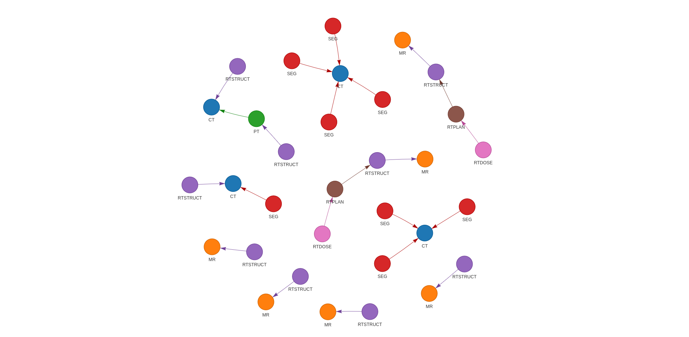

# Interlacer Module

The **Interlacer** module constructs and queries a hierarchical forest of DICOM series using metadata relationships. This enables efficient grouping, querying, and visualization of medical imaging data. This module is a replacement for the old `DataGraph` module in `med-imgtools 1.0`

---

## Overview

The module defines a tree-based representation of DICOM series, using their metadata to build a hierarchy. This structure allows users to easily traverse relationships between series (e.g., CT → RTSTRUCT), enabling advanced queries and grouping.

---

## Classes

### `SeriesNode`
Represents an individual DICOM series and its hierarchical relationships. Acts as a node in the forest structure.

### `Branch`
Represents a single path through the hierarchy, preserving an ordered sequence of modalities. Useful for identifying complete imaging workflows (e.g., CT → RTSTRUCT → RTDOSE).

### `GroupBy` *(Enum)*
Used to specify how DICOM series should be grouped. Options include:
- `ReferencedSeriesUID`
- `StudyInstanceUID`
- `PatientID`

> **Note:** Currently, only `ReferencedSeriesUID` is supported.

### `Interlacer`
The main class of the module. Responsible for:
- Building the hierarchical forest
- Processing modality-based queries (e.g., "CT,RTSTRUCT")
- Visualizing the forest structure

---

## Usage Example

```python
from pathlib import Path
from rich import print  # noqa

from imgtools.dicom.crawl import (
    CrawlerSettings,
    Crawler,
)
from imgtools.dicom.interlacer import Interlacer

# Define path to DICOM directory
dicom_dir = Path("data")

# Create crawler settings and crawler instance
crawler_settings = CrawlerSettings(
    dicom_dir=dicom_dir,
    n_jobs=12,
    force=False
)
crawler = Crawler(crawler_settings)
interlacer = Interlacer(crawler.index)

# Visualize the constructed forest
interlacer.print_tree(dicom_dir)
interlacer.visualize_forest(dicom_dir / "interlacer.html")

# Query modality chains (e.g., CT followed by RTSTRUCT)
query = "CT,RTSTRUCT"
samples = interlacer.query(query)
```

## Example Output

{: style="height:125%;"}

{: style="height:125%;"}
