# Taming the Chaos: AutoPipeline for Medical Image Processing

## TLDR; From Raw Data to Research-Ready in Minutes

AutoPipeline bridges the gap between raw clinical data and research analysis, 
making it easier for imaging researchers of all experience levels to work with 
complex medical imaging data.

By standardizing the processing pipeline and capturing provenance information, 
it also improves reproducibility - a crucial aspect of scientific research.

## The Medical Imaging Data Problem

Ever spent hours organizing messy DICOM files from different scanners and 
institutions? Medical imaging datasets are notoriously complex - with multiple
scan types, segmentation masks, and treatment plans all interconnected but
scattered across folder structures that seem designed to confuse.

As an imaging researcher or student, you've probably faced this frustration:

- **Folder chaos**: Hundreds of nested directories with cryptic names
- **Format soup**: DICOM files that need conversion to research-friendly formats
- **Relationship puzzles**: CT scans that reference segmentation masks that 
  reference treatment plans
- **Name confusion**: Different institutions using different terms for the same 
  anatomical structures

## AutoPipeline: Streamlined Medical Imaging Workflow

AutoPipeline is the core automation feature of med-imagetools designed to rescue
you from these headaches. It provides a streamlined, reproducible workflow that:

1. **Crawls** through your messy DICOM directories to discover all files
2. **Indexes** the metadata and builds relationships between different series
3. **Processes** linked series together, applying transformations as needed
4. **Organizes** the output in a clean, standardized structure
5. **Tracks** everything it does for complete reproducibility

Think of it as your personal research assistant that handles all the tedious
data preparation work, letting you focus on the exciting science!

## How AutoPipeline Works

Behind the scenes, AutoPipeline brings together several powerful components:

```mermaid
flowchart TD
	subgraph Ingest["Ingest 📂 + 📇"]
		A[Input DICOM Directory]
		B[Crawler]
		C[Index File]
		A --> B --> C
	end

	subgraph Relationship_Builder["Relationship Builder 🕸️ "]
		D[Interlacer]
		E[Query Results]
		D --> E
	end

	subgraph Processing["Processing 🖼️ + 🔧"]
		F[Sample Input]
		G["MedImage Objects: Scan/VectorMask"]
		H["Transforms (optional): Resample, Windowing"]
		I[Processed Images]
		F --> G --> H --> I
	end

	subgraph Output["Output 📁 + 📝"]
		J[Sample Output]
		K[NIfTI Files]
		J --> K
	end

    Ingest --> Relationship_Builder
    Relationship_Builder --> Processing
    Processing --> Output

```



### Crawler: The Data Explorer

First, AutoPipeline dispatches the **Crawler** to search recursively through 
your input directories. The Crawler identifies all DICOM files and extracts key 
metadata like:

- Patient identifiers  
- Study and series UIDs
- Modality information (CT, MR, RTSTRUCT, etc.)
- Spatial characteristics
- References between series

This information is compiled into an index that serves as a map of your entire 
dataset.

### Interlacer: The Relationship Builder

Next, the **Interlacer** takes this index and constructs a hierarchical forest 
that represents the relationships between different series. It understands the 
DICOM standards and knows, for example, that:

- An `RTSTRUCT` (radiation therapy structure) references a specific CT series
- A `PET` scan might be registered to a corresponding CT
- A treatment plan (`RTPLAN`) might hold the information about the referenced
    `RTSTRUCT` used in a `RTDOSE` file

The Interlacer can visualize these relationships and query them based on 
modality combinations you're interested in.

### Sample Processing: The Conversion Engine

When you specify which modalities you want (like `"CT,RTSTRUCT"`), AutoPipeline:

1. Queries the Interlacer for samples matching your criteria
2. Loads the DICOM data into memory as MedImage objects
3. Applies transformations like resampling or intensity windowing
4. Saves the results in standard research formats (`NIfTI`)

For segmentation data (`RTSTRUCT` or `SEG`), AutoPipeline can match region names 
(like "parotid" or "GTV") to standardized keys using regular expressions, 
solving the problem of inconsistent naming across institutions.

## Using AutoPipeline: A Quick Start

Using AutoPipeline is simple! 

The command line interface provides an intuitive way to process your data:

??? info "Full CLI Interface"

    [API Reference][imgtools-autopipeline]

    

=== "Basic Usage"
    ```bash
    # Basic usage with CT and RT structure sets
    imgtools autopipeline \
        --modalities CT,RTSTRUCT \
        /path/to/messy/dicoms/ \
        /path/to/output/
    ```

=== "With Transformations"
    ```bash
    # Adding transformations 
    imgtools autopipeline\
        --modalities CT,RTSTRUCT \
        --spacing 1.0,1.0,1.0 \
        --window-width 400 --window-level 40 \
        /path/to/dicoms/ \
        /path/to/output/
    ```

=== "Force Update the Index"
    ```bash
    # Force update the index if you have new files
    imgtools autopipeline \
        --modalities CT,RTSTRUCT \
        --update-crawl \
        /path/to/dicoms/ \
        /path/to/output/
    ```

### Standardizing Region Names with ROI Matching

A common challenge in medical imaging is inconsistent naming of regions of 
interest (ROIs). AutoPipeline solves this with powerful pattern matching.

Med-ImageTools implements the `ROIMatcher` class, which allows you to define
pattern matching rules for your ROIs.
AutoPipeline will match the ROI names from your RTSTRUCT or SEG files against 
these patterns and standardize them in the output files.

We flexibly support describing these in the CLI and/or in a YAML file.

=== "With CLI"

    ```bash
    imgtools autopipeline\
        --modalities CT,RTSTRUCT \
        -rmap "GTV:GTV,gtv,Gross.*Volume" \
        -rmap "Parotid_L:LeftParotid,PAROTID_L,L_Parotid" \
        -rmap "Parotid_R:RightParotid,PAROTID_R,R_Parotid" \
        -rmap "Cord:SpinalCord,Cord,Spinal_Cord" \
        -rmap "Mandible:mandible.*" \
        /path/to/dicoms/ \
        /path/to/output/
    ```


=== "With YAML File"
    Create a YAML file like this:

    ```yaml
    # roi_patterns.yaml
    GTV: ["GTV", "gtv", "Gross.*Volume"]
    Parotid_L: ["LeftParotid", "PAROTID_L", "L_Parotid"]
    Parotid_R: ["RightParotid", "PAROTID_R", "R_Parotid"]
    Cord: ["SpinalCord", "Cord", "Spinal_Cord"]
    Mandible: ["mandible.*"]
    ```

    Then run AutoPipeline with the `--roi-match-yaml` option:
    
    ```bash
    imgtools autopipeline\
        --modalities CT,RTSTRUCT \
        --roi-match-yaml roi_patterns.yaml
    ```

## Advanced Features

### Parallel Processing

Processing large datasets? AutoPipeline can parallelize operations:

```bash
imgtools autopipeline /path/to/dicoms/ /path/to/output/ \
    --modalities CT,RTSTRUCT \
    --jobs 8  # Use 8 parallel processes
```

### Custom Output Formatting

Control your output file structure with formatting patterns:

```bash
imgtools autopipeline /path/to/dicoms/ /path/to/output/ \
    --modalities CT,RTSTRUCT \
    --filename-format "{PatientID}/{Modality}/{ImageID}.nii.gz"
```

### Handling Existing Files

Choose how to handle existing files in your output directory:

```bash
imgtools autopipeline /path/to/dicoms/ /path/to/output/ \
    --modalities CT,RTSTRUCT \
    --existing-file-mode skip  # Options: skip, overwrite, fail
```

## Additional Resources

For more details on the components that AutoPipeline uses:

- [Crawler Documentation](../reference/dicom/crawl/crawler.md)
- [Interlacer Documentation](../reference/dicom/interlacer.md)
- [ROI Matching and Masks] TODO::

## References

1. Kim S, Kazmierski M, et al. (2025). "Med-ImageTools: An open-source Python 
   package for robust data processing pipelines and curating medical imaging 
   data." F1000Research, 12:118.

2. Clark K, Vendt B, Smith K, et al. (2013). "The Cancer Imaging Archive (TCIA): 
   Maintaining and Operating a Public Information Repository." Journal of Digital 
   Imaging, 26(6):1045-1057.