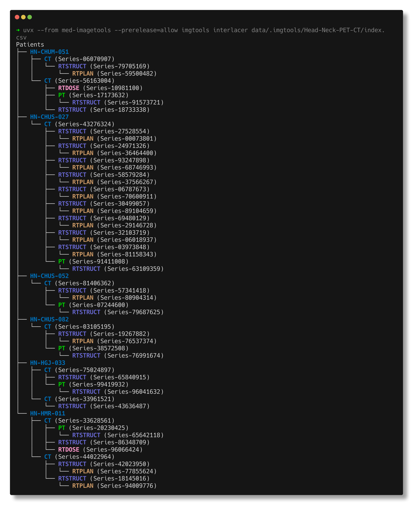
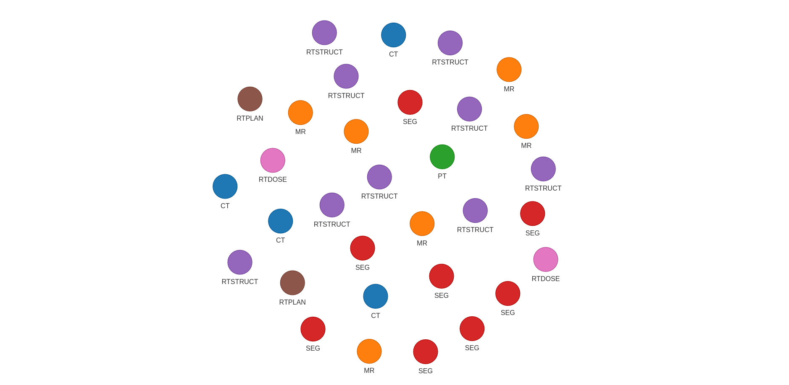
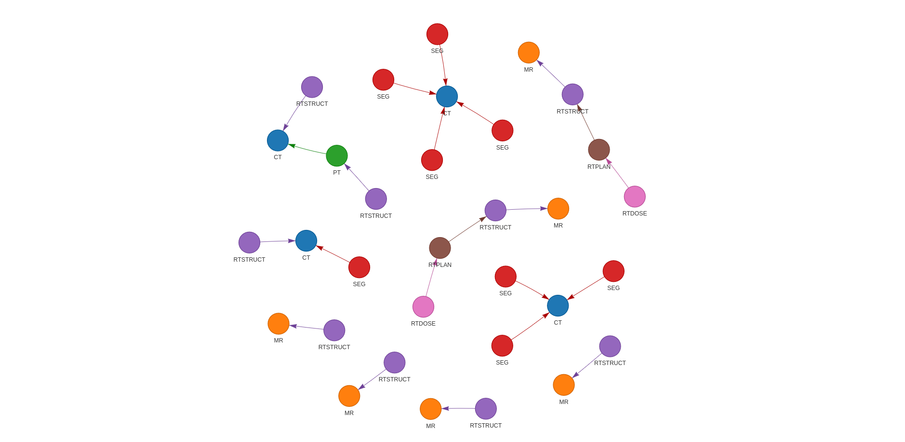

# Interlacer Module

The **Interlacer** module builds and searches a tree-like structure made from
DICOM series using metadata links. 

This module enables efficient grouping, querying, and vizualization of medical
imaging series. The module turns DICOM series into a set of trees (a forest), using metadata
to connect related series. This helps users follow the relationships between
series — for example, linking a `CT` scan to its `RTSTRUCT` and `RTDOSE` —
and makes it easier to run queries or group series by type.


!!! note 

    This module is available in `med-imagetools 2.0` and later versions.
    It replaces the now deprecated `DataGraph` module from `med-imagetools 1.0`.

---
## Usage Example

### CLI 

{: style="background: white; height:125%;"}


### Python Code

```python
from pathlib import Path
from imgtools.dicom.crawl import Crawler
from imgtools.dicom.interlacer import Interlacer

# Define path to DICOM directory
dicom_dir = Path("data/")

# Create crawler and scan the directory
crawler = Crawler(
    dicom_dir=dicom_dir,
    n_jobs=5,
    force=False,
)
crawler.crawl()

# Create the Interlacer from crawler results
interlacer = Interlacer(crawler.index)

# Visualize the forest structure
interlacer.print_tree(dicom_dir)  # Console visualization

# Query for specific modality combinations
# Find CT series with associated RTSTRUCT objects
ct_rtstruct_results = interlacer.query("CT,RTSTRUCT")

# Get all possible series combinations
all_results = interlacer.query("*")  # or interlacer.query("all")
```

## Example Output

**Visualization of the raw graph containing all series in the DICOM directory:**

{: style="background: white; height:125%;"}

**Visualization of The interlaced connections between series:**

{: style="background: white; height:125%;"}

!!! note
    ## Query Rules and Dependencies

    The Interlacer enforces the following modality dependency rules:

    1. `RTSTRUCT` and `RTDOSE` require a `CT`, `MR`, or `PT` series
    2. `SEG` requires a `CT` or `MR` series

    Examples of valid and invalid queries:

    - ✅ `"CT,RTDOSE"` - Valid: CT with associated RTDOSE
    - ✅ `"CT,PT,RTSTRUCT"` - Valid: CT and PT with associated RTSTRUCT
    - ❌ `"PT,SEG"` - Invalid: SEG requires CT or MR, not PT
    - ❌ `"RTSTRUCT,RTDOSE"` - Invalid: Both require a source imaging series

---

## Main Classes

### `SeriesNode`

Represents an individual DICOM series and its hierarchical relationships:

- **Attributes**:
  - `SeriesInstanceUID`
  - `Modality`
  - `PatientID`
  - `StudyInstanceUID`
  - `folder`: Path to the folder containing the DICOM files
  - `ReferencedSeriesUID`: Series that this one references, if any
  - `children`: List of child nodes representing referenced series
    - i.e a `CT` series might have 1 or more links to `RTSTRUCT` and/or  `PT` series

---
### `Interlacer`

Key features:

- **Query validation**: Ensures that modality queries follow DICOM standard requirements
- **Interactive visualization**: Creates HTML-based network graphs of relationships
- **Rich text console display**: Pretty-prints the hierarchy with color-coding
- **Dependency validation**: Enforces rules like "RTSTRUCT requires CT, MR, or PT"

??? warning "Supported Modalities"

    Though the Crawler will indiscriminately crawl all DICOM files,
    the Interlacer currently only supports the following modalities for interlacing:

        - CT
        - MR
        - PT
        - RTSTRUCT
        - RTDOSE
        - SEG
        - RTPLAN (used in interlacing but not in queries)

    These were the primary modalities targeted during the development of this module,
    but can easily be extended to support others in the future.
    Please [open an issue](https://github.com/bhklab/med-imagetools/issues)
    for which modalities you would like to see supported.

### Grouping Series

The Interlacer currently groups series using **Referenced Series UID**,
which links series based on their metadata references 
(i.e the `ReferencedSeriesInstanceUID` tag in `RTSTRUCT`s).
This creates a hierarchical structure showing the relationships between different series.

??? info "Future Support for Grouping by Study Instance UID and Patient ID"
    
    In a future release, the Interlacer will support additional grouping methods:
    
    - **Study Instance UID** – Group everything in the same study
    - **Patient ID** – Group all series from the same patient
    
    This enhancement is being tracked in [GitHub issue #318](https://github.com/bhklab/med-imagetools/issues/318).
