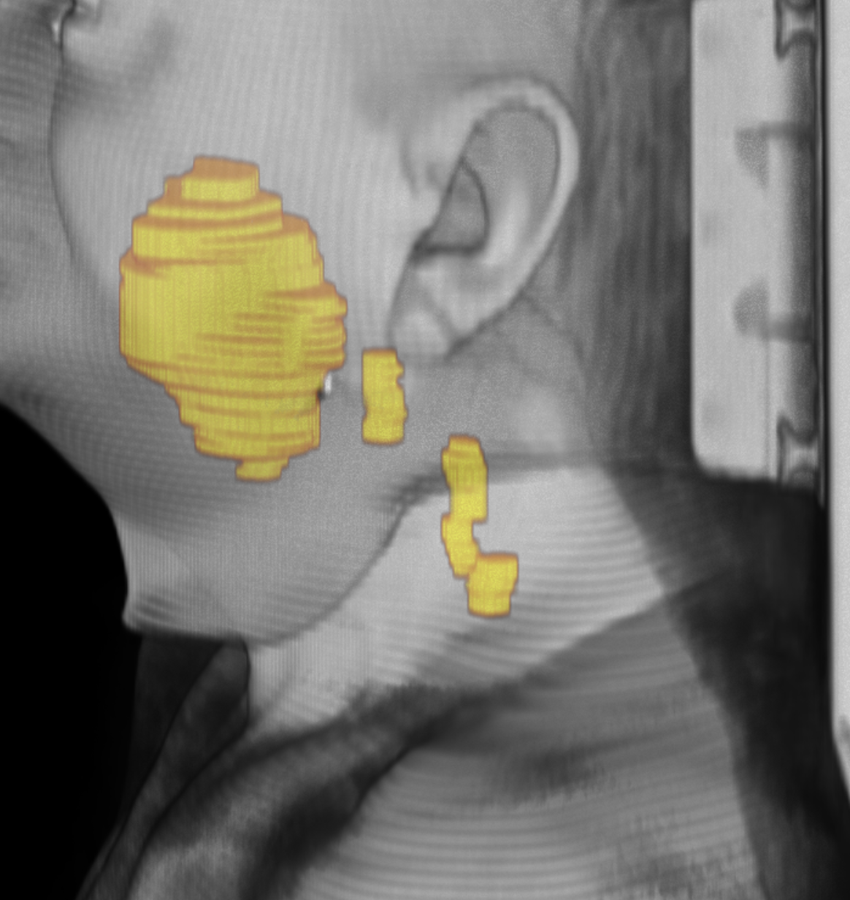
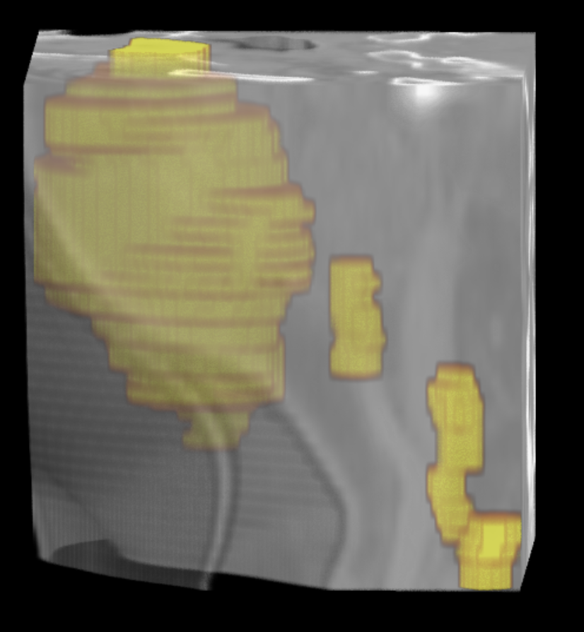

# `Mask` and `VectorMask` data structure design proposal

## General context for reference

The previous `Segmentation` class was designed to be a `sitk.Image` with each
voxel representing a vector.
The `to_segmentation` step from the old `Structureset` class would
extract the rois of interest and then construct a stack of 3D binary images,
converted to a single `sitk.Image` with a vector pixel type via
`sitk.ImageFromArray(isvector=True)`.

We then pretty much either extracted the binary images from the `Segmentation`
or created the sparse mask of all the structures to get a single 3D Image
with type `sitk.sitkUInt8`.

On top of that, the `roi_names` parameter used to be pretty confusing,
being too flexible, and hard to use along with the different configurations.

We now have a [a clear, more strict approach to how we choose roi names](./masktypes/README.md)
where user can define `keys` that maps to one or more `patterns`/`literals` via
the `ROIMatcher` class and we can use that with the `ROIMatchStrategy` to 
return a mapping from their `key` to extracted `binary image` made up of one 
or more (multiple squashed if `ROIMatchStrategy.MERGE` is used) matched ROIs.


```python
class ROIMatchStrategy(str, Enum):
    """Enum for ROI handling strategies."""

    # merge all ROIs with the same key
    MERGE = "merge"

    # for each key, keep the first ROI found based on the pattern
    KEEP_FIRST = "keep_first"

    # separate all ROIs
    SEPARATE = "separate"

class ROIMatcher:
    match_map: dict[str, list[str]]
    handling_strategy: ROIMatchStrategy
    ignore_case: bool

    def match_rois(self, roi_names: list[str]) -> list[tuple[str, list[str]]]:
        """Match ROIs names against the provided patterns."""
        # returns a list of tuples (roi_key, [matched roi_names])
        # based on the strategy
        ...
```

## Thoughts

In the interest of having flexible data structures, I think its worth
thinking about a couple of things:

### Data after exraction

**`Segmentation.get_label`**
The saved NIFTI files after extracting from the old `Segmentation` class
were always `sitk.sitkUInt8` images **with a single label**.
- I dont think this is a problem, in any case its predictable, and we always
    know the label of the mask.

**`Segmentation.to_sparsemask`**
In my opinion, this approach is by design, lossy, as it resolves overlapping 
regions by assigning the label of the highest-index region, returning a single-label 
image from the vector mask.

### Object count 

If we use `ROIMatchStrategy.MERGE`, and multiple, disconnected ROIs are found,
we **MIGHT** end up with multiple objects with the same label for a given
key:

> [!NOTE]
> I just realized this can **definitely** still happen even if we were to 
> use `ROIMatchStrategy.SEPARATE` if the annotater annotated two disconnected
> structures like in the example below, where only `['GTV-2', 'GTV-1']`
> were matched but there are 4 objects.

```python

matcher = ROIMatcher(
    match_map={"GTV": ["GTV.*"]},
    handling_strategy=ROIMatchStrategy.MERGE,
    ignore_case=True,  # important for matching lowercase labels
)

# Mapped: (roi_key='GTV', roi_names=['GTV-2', 'GTV-1'])
### .... vector extracted mask logic to get scalar mask

# this mask only has 1 label, but 4 objects
cc = sitk.ConnectedComponentImageFilter()
cc.Execute(extracted_scalar_mask)
cc.GetObjectCount()
# Output: 4
```



If we then crop both the image and merged mask to the sitk-calculated
bounding box of the mask, we get this:



Personally, I have 0 idea what the repercussions here are, but
wanted to present this as a potential thought


I have functions to convert the binary mask of multiple objects and one label
to an image with mutiple labels, but we should up for discussion on whether
this is a problem at all

### Separate data structures for `Mask` and `VectorMask`

After discussing with @skim2257, I am interested in defining two 
data structures for the two types of masks we will be using:

1. `Mask` is a 3D `sitk.Image` of scalar type `sitk.sitkLabelUInt8` while
2. `VectorMask` is a 3D `sitk.Image` of vector type `sitk.sitkVectorUInt8`.

`DICOM-SEG` and `RTStructureSet` will produce `VectorMask` images still,
based on the `ROIMatcher`

Motivation for the `Mask` class is to have a class that we can identify
and adjust transforms for based on class type, especially when we
read ***from niftis***.

The `VectorMask` essentially replaces the `Segmentation` class,
but given this distinction, we can build tooling around this as well,
including how to handle transforms on this data structure.

### Statistics Calculations

I had some working prototype of calculating statistics to be outputted
into the `index.csv` on nifti save in https://github.com/bhklab/med-imagetools/pull/226 

Based on above, I believe these sort of metrics would become more valuable
so we would know things like `object count`, `volume`, `diameter` of our 
saved masks, without having to open the image and mask in a viewer. 

Similar to how we [calculate stats from the new base `MedImage` class](base_medimage.py#L113-123)
we can build these into the new mask classes for easy access.

## Proposed data structure

Prototyped out the interface for this

```python
class Mask(MedImage):
    """A scalar label mask image with sitk.LabelUInt8 pixel type.
    
    Valid voxel types: `sitk.sitkUInt8`, `sitk.sitkLabelUInt8`
    """

    @property
    def unique_labels(self) -> np.ndarray:
        """Return all unique label values present in the image."""
        ...

    def to_labeled_image(self) -> Mask:
        """Convert to a labeled image with unique labels."""
        # this is a sitk.Image with type sitk.sitkLabelUInt8

    def to_vector_mask(self) -> VectorMask:
        """Convert label image to a one-hot binary vector mask.
        
        One-hot as in if there is more than 1 label, we will have a vector
        with the number of labels as the number of channels.
        """
        ...

    @classmethod
    def from_array(
        cls, array: np.ndarray, reference: sitk.Image | MedImage
    ) -> Mask:
        """Create Mask from numpy array with copied spatial metadata."""
        ...

ROIMaskMapping = namedtuple("ROIMaskMapping", ["roi_key", "roi_names"])

class VectorMask(MedImage):
    """A multi-label binary mask image with vector pixels (sitkVectorUInt8)."""

    # roi_mapping is a dict of roi_key to (roi_name, [matched roi_names from rtstruct/seg])
    roi_mapping: dict[int, ROIMaskMapping]
    metadata: dict[str, str]
    errors: dict[str, ROIExtractionErrorMsg] | None

    @property
    def n_masks(self) -> int:
        """Number of binary mask channels (components per voxel)."""
        ...

    @property
    def roi_keys(self) -> list[str]:
        """List of ROI keys from mapping"""
        ...


    def iter_masks(self) -> Iterator[tuple[int, str, Mask]]:
        """Yield (index, roi_key, Mask) for each mask channel."""
        ...

    def has_overlap(self) -> bool:
        """Return True if any voxel has >1 mask"""
        ...

    def to_sparsemask(self) -> Mask:
    """Convert to a single binary mask by resolving overlaps with the highest-index label."""
        ...

    def to_label_image(self) -> Mask:
        """Convert to scalar Mask image (fails if overlap exists).
        
        By only working if no overlaps, this would not be lossy, 
        as we would have a unique label for each mask.
        """
        ...

    def extract_mask(self, key_or_index: str | int) -> Mask:
        """Extract a single binary mask by index or ROI key.
        
        Result would only have 1 label, output type is `sitk.sitkUInt8`
        """
        ...

    @classmethod
    def from_rtstruct(
        cls,
        reference_image: imgtools.coretypes.Scan,
        rtstruct: StructureSet,
        roi_matcher: ROIMatcher,
    ) -> VectorMask:
        """Create VectorMask from RTSTRUCT using ROI matching."""
        # can also just use the `to_vectormask` from the specific class
        ...

    @classmethod
    def from_seg(
        cls,
        reference_image: imgtools.coretypes.Scan,
        seg: DicomSeg, 
        roi_matcher: ROIMatcher,
    ) -> VectorMask:
        """Create VectorMask from DICOM-SEG using ROI matching."""
        # can also just use the `to_vectormask` from the specific class
        ...
```

## Bonus: Saving the `VectorMask`

We can also choose to save the vector mask itself, and now once I implement
the ability to embed metadata (`json`, raw `pydicom.Dataset` elements, maybe
even the picklable object itself) into the NIFTI header via the new
extensions standard, we can save the `roi_mapping` into the NIFTI,
and provide the tooling to convert it back to the `VectorMask` object
from the NIFTI.

I personally fancy this idea, of saving all possible rois separately as 
a single vector structure, maintaining as **raw as possible** if we were to 
then serve the data via Med-ImageNet. All downstream workflows can then
work off the interlaced, aligned, raw data, including possibly ROI matching
from the `VectorMask` itself.