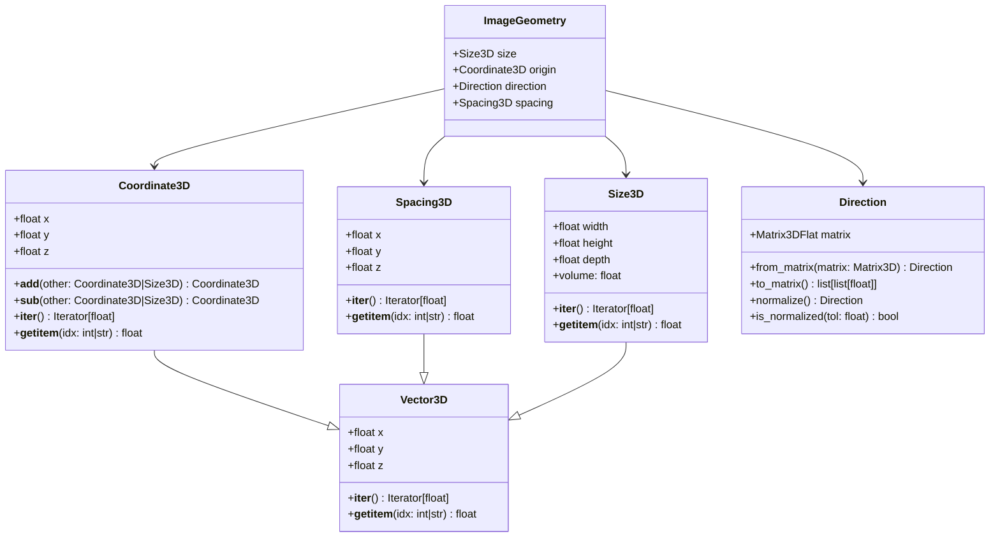

# Class Inheritance Diagram

## Explanation

- **Inheritance (`--|>`)**
  - `Coordinate3D`, `Spacing`, and `Size3D` inherit from `Vector3D`.
- **Composition (`-->`)**
  - `ImageGeometry` **contains** `Size3D`, `Coordinate3D`, `Direction`, and `Spacing3D`.
