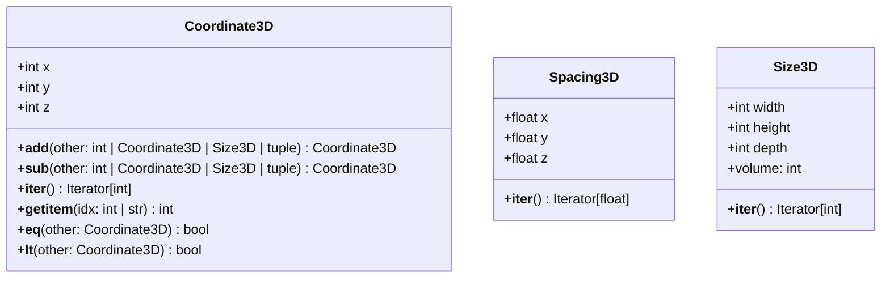

# Class Diagram

```mermaid
classDiagram
    class Coordinate3D {
        +int x
        +int y
        +int z
        +__add__(other: int | Coordinate3D | Size3D | tuple) Coordinate3D
        +__sub__(other: int | Coordinate3D | Size3D | tuple) Coordinate3D
        +__iter__() Iterator[int]
        +__getitem__(idx: int | str) int
        +__eq__(other: Coordinate3D) bool
        +__lt__(other: Coordinate3D) bool
    }

    class Spacing3D {
        +float x
        +float y
        +float z
        +__iter__() Iterator[float]
    }

    class Size3D {
        +int width
        +int height
        +int depth
        +volume: int
        +__iter__() Iterator[int]
    }
```
